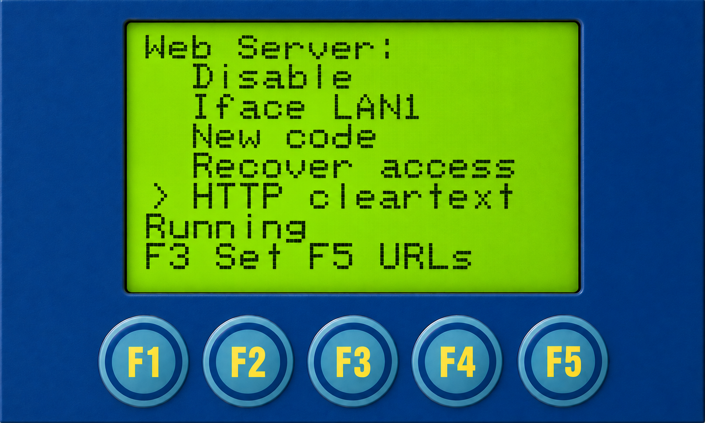
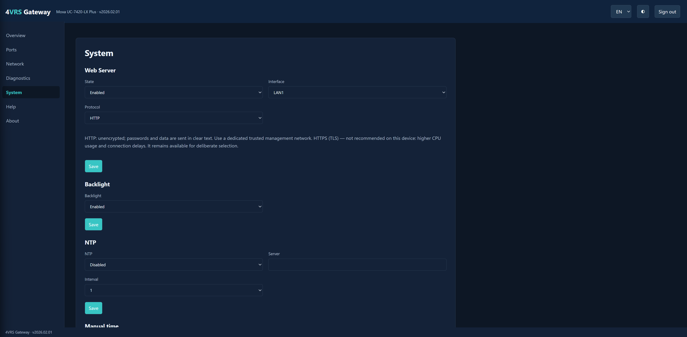

# 4VRS Gateway

**Modbus and transparent serial gateway for Moxa UC-7420-LX Plus.**

English · [Русский](README.ru.md) · [User guide](docs/user-guide.md)

Eight independently configurable RS-232 / RS-485 / RS-422 ports, managed from
the device's own display and keys. Runs on the existing Moxa Linux system;
the kernel and drivers remain in place.

**Status:** [v2026.02.01 is released](https://github.com/dk-1983/moxa-4vrs-gateway/releases/tag/v2026.02.01). See the [qualified operating scope](docs/release-final.md).
[Evidence and limitations](docs/validation.md) · [Release notes](docs/releases/v2026.02.01.md) · [LCD and Web screens with menu paths](docs/screens.md).

## Features

| Capability | Implementation |
| --- | --- |
| Serial | Independent P1–P8 settings; RS-232, RS-485 2/4-wire, RS-422 |
| Modbus TCP | MBAP-framed TCP requests bridged to serial Modbus RTU |
| Modbus UDP | MBAP-framed UDP requests bridged to serial Modbus RTU |
| RTU over UDP | RTU frames, including CRC, in UDP datagrams |
| RAW TCP / RAW UDP | Transparent serial data transport without Modbus interpretation |
| Local management | LCD/keypad settings, port states, counters and diagnostics |
| Network | LAN1/LAN2 static IPv4 or DHCP client, mask, default route, DNS |
| Network changes | Review, temporary Apply, explicit Keep, manual/timed Revert |
| Clock | RTC, NTP, 1/6/24-hour intervals, three-attempt diagnostic mode |
| Persistence | Saved product settings and confirmed network policy restored at startup |

Your software connects to Gateway over the network using TCP or UDP. Gateway
passes requests to the connected instrument over RS-232, RS-485 or RS-422 and
returns its replies to the software. Select the same transport in Gateway and
your software: **Modbus TCP, Modbus UDP, RTU over UDP, RAW TCP or RAW UDP**.
Their connection and data-framing rules are described in the table above.

The automatic installer and backlight controls are implemented, with scoped hardware acceptance from prior releases. Release v2026.02.01 adds Web and a separate CF preparation wizard; their tested boundaries are listed in the validation status.

## Display and local menu

<table><tr><td></td><td><pre>Home (F3 → Main Menu) ←</pre></td></tr></table>

*Home screen.*

Home shows application readiness, ready ports, errors and clients. In this
example all eight enabled ports are ready, with zero errors and zero clients.
Port readiness is not proof of an instrument response. **F1 Help** opens help;
**F3 Menu** opens the main menu. Follow the bottom-line key prompts as you move
between settings. See the [user guide](docs/user-guide.md) for port configuration,
network Apply/Keep/Revert and NTP.

<table><tr><td></td><td><pre>Home
└─ Main Menu (F3) ←</pre></td></tr></table>

*Main menu.*

Use **F2/F4** to move, **F3** to open a section and **F1** to return.

| Section | Purpose |
| --- | --- |
| Status | Application status |
| Ports | Individual port states and counters |
| Configuration | Serial/transport settings and access to network settings |
| Diagnostics | Diagnostics and startup events |
| System | Date/time, platform, NTP, Display / Backlight and Web Server |
| Shutdown | Stop Gateway; does not power off the Moxa OS |
| About | Product and version information |

### Port status

<table><tr><td></td><td><pre>Main Menu
└─ Ports ←</pre></td></tr></table>

*Port list.*

Use F2/F4 to select among P1–P8; the list scrolls to reveal the remaining
ports. **F3 Detail** opens the selected port's status pages. `READY` describes
the port runtime, not a confirmed response from a connected instrument.

<table><tr><td></td><td><pre>Main Menu
└─ Ports
   └─ P1 ←</pre></td></tr></table>

*Port connection settings.*

The first detail page shows UART, serial mode/framing, transport and listener.
Here P1 uses `ttyM0`, RS485-2W, 115200 baud and Modbus TCP on port 1502.
`8NONE1` means 8 data bits, no parity and 1 stop bit (8N1). These are example
settings, not the factory defaults. F2/F4 cycle through the four detail pages.

### Configuration and network

<table><tr><td></td><td><pre>Main Menu
└─ Configuration ←</pre></td></tr></table>

F2/F4 select a port; **F3 Select** opens its configuration. **F5 Network**
opens the LAN, default-route and DNS pages.

<table><tr><td></td><td><pre>Main Menu
└─ Configuration
   └─ Network (F5)
      └─ LAN2 ←</pre></td></tr></table>

*LAN2 network settings.*

**Confirmed policy** shows accepted settings. F2/F4 switch pages, F5 opens
the editor and F1 returns. Changes use Review → Apply → Keep, with Revert
available during the confirmation window. See the [network instructions](docs/user-guide.md#network-settings).

### Clock and NTP

<table><tr><td></td><td><pre>Main Menu
└─ System
   └─ Platform (F4)
      └─ Network Time (F5) ←</pre></td></tr></table>

Open **System → F4 Platform → F5 Network Time** to view synchronization status and settings.
**F5 Edit** changes the NTP settings. Choose a normal interval of 1, 6 or 24 hours;
the default is 1 hour. **F4 Test** starts three attempts at one-minute intervals,
then automatically returns to the configured schedule.

*Network time settings.*

### Diagnostics

<table><tr><td></td><td><pre>Main Menu
└─ Diagnostics ←</pre></td></tr></table>

*Diagnostics counters.*

Open **Main Menu → Diagnostics** to view accepted and completed requests,
timeouts, recoveries, stale responses and the queue high-water mark.
**F3 Events** opens startup events.

<table><tr><td></td><td><pre>Main Menu
└─ Diagnostics
   └─ Startup Events (F3 Events on LCD) ←</pre></td></tr></table>

*Startup events.*

Use **F2/F4** to browse events. Each entry shows its sequence, startup stage,
progress, result and error. `BOOT / Progress 0%` describes the selected startup
event, not the application's current readiness.

## Compatibility and installation

Hardware-tested: **Moxa UC-7420-LX Plus**, legacy XScale big-endian Linux.
**UC-7410-LX Plus** and other UC-74xx variants are related models, but have not
been hardware-qualified. The family name is not a tested-device list.

Product files and configuration use CompactFlash under `/var/hda/4vrs/`.
Minimal startup integration remains on internal storage.

The full installer and CF wizard are available in [v2026.02.01](https://github.com/dk-1983/moxa-4vrs-gateway/releases/tag/v2026.02.01). Follow the [commissioning procedure](docs/release-final-commissioning.md).

Read the [user guide](docs/user-guide.md) for operating an installed system.
Initial migration retains supported existing device settings and network addresses.

## New-configuration defaults

These are defaults for a new product configuration, not a device-reset instruction.

| Setting | Default |
| --- | --- |
| P1–P8 | Enabled, RS-232, 9600 baud, 8N1 |
| Transport | Modbus TCP |
| Listener | `0.0.0.0`, ports 502–509 respectively |
| NTP | Disabled; normal interval 1 hour |
| Network preference | Static IPv4; optional DHCP client, no DHCP server |

Network enrollment imports supported existing settings. It does not assign a
universal factory IP or silently convert existing DHCP settings to static.

## Development and verification

C source targets ARMv5TE/XScale big-endian using the separate legacy Moxa
toolchain. See the [build environment](docs/architecture/build-environment.md).
Vendor firmware, toolchains and manuals are not redistributed with this project.

Verification combines host regressions, selected UBSan tests, target ABI audits
and device experiments. See the [validation status](docs/validation.md)
for passed cases and remaining qualification. Component tests, TCP connections
and instrument transactions prove different scopes.

Versions use [`vYEAR.RELEASE.PATCH`](docs/versioning.md). Release and patch counters start at `00`, except for the first public release, `v2026.00.01`. The current published release is **v2026.02.01**.

## Contributing and license

[Issues](https://github.com/dk-1983/moxa-4vrs-gateway/issues) welcome reproducible
problems and suggestions. Include model, version, transport, serial settings
and sanitized logs. See [CONTRIBUTING.md](CONTRIBUTING.md) and [SECURITY.md](SECURITY.md).

Original code and documentation use the [MIT License](LICENSE). See
[THIRD_PARTY.md](THIRD_PARTY.md) for vendor boundaries. This independent project
is not an official Moxa firmware release.

## Web on UC-7420-LX Plus

HTTPS is not recommended for this device due to additional processing overhead and connection delays. Password verification during sign-in causes a temporary high CPU load — approximately **92% in testing** — regardless of the protocol.

After optimization, normal Web panel use places little load on the processor: in the user-operated HTTP test, the Web process averaged approximately **0.06% CPU**, excluding the separate password-verification process. After sign-in, the interface is responsive in both modes.

HTTP is recommended for a dedicated trusted management network and remains the default for new installations. HTTP sends passwords and data without encryption. HTTPS (TLS) remains available, but is not recommended on Moxa UC-7420-LX Plus. Upgrades preserve explicit HTTP/HTTPS choices; schema 1/2 configurations without a protocol field retain legacy HTTPS. A single-client limit and password hashing do not protect data transmitted over HTTP.

[Measurement conditions and limitations](docs/release-final.md).

[Autonomous RNG operation](docs/rng-autonomous-v1.md) · [Release scope](docs/releases/v2026.02.01-scope.md).

### Web and new LCD controls

[Complete LCD/Web trees and operating instructions](docs/user-guide.md). System includes Display / Backlight and Web Server: enable, interface, HTTP/HTTPS, one-time code, access recovery, URLs and certificate. All seven Web sections and settings forms are illustrated in the guide.

<table><tr><td></td><td><pre>Main Menu
└─ System
   └─ Web Server (F2, F3 Open)
      └─ HTTP cleartext ←</pre></td></tr></table>

<table><tr><td></td><td><pre>Web
└─ System
   └─ Web Server
      └─ Protocol: HTTP ←</pre></td></tr></table>
