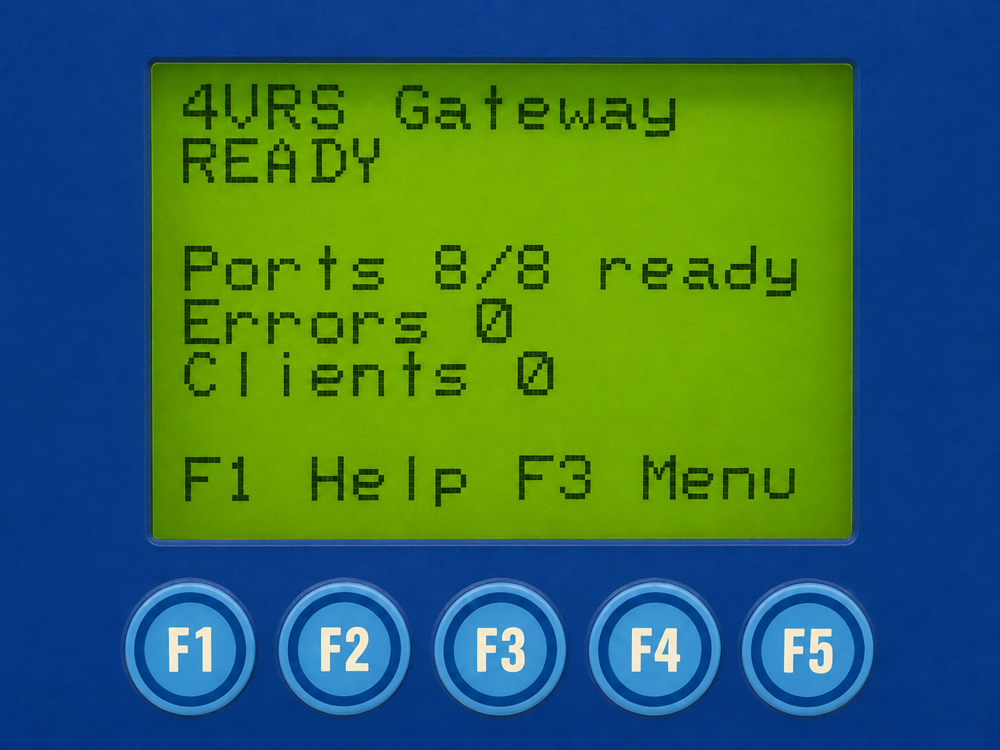
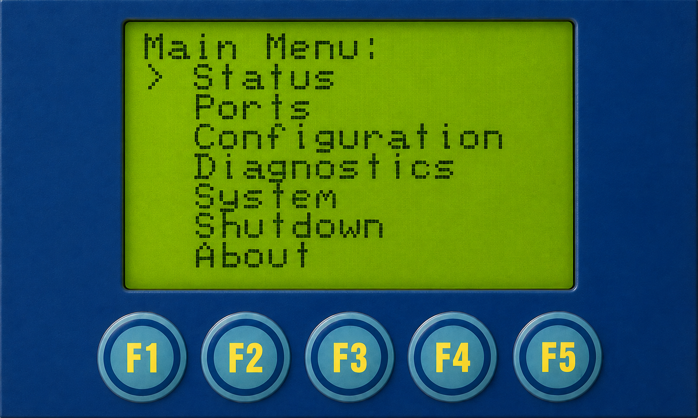
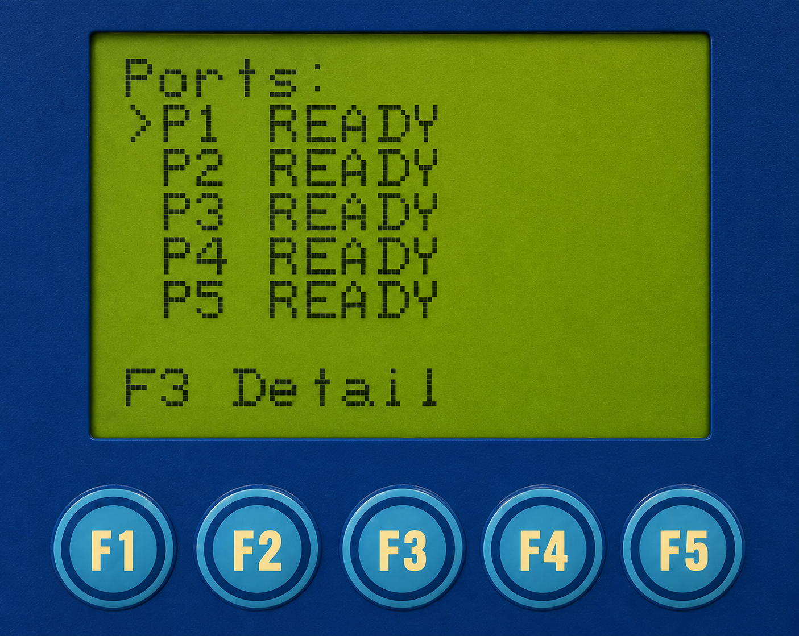
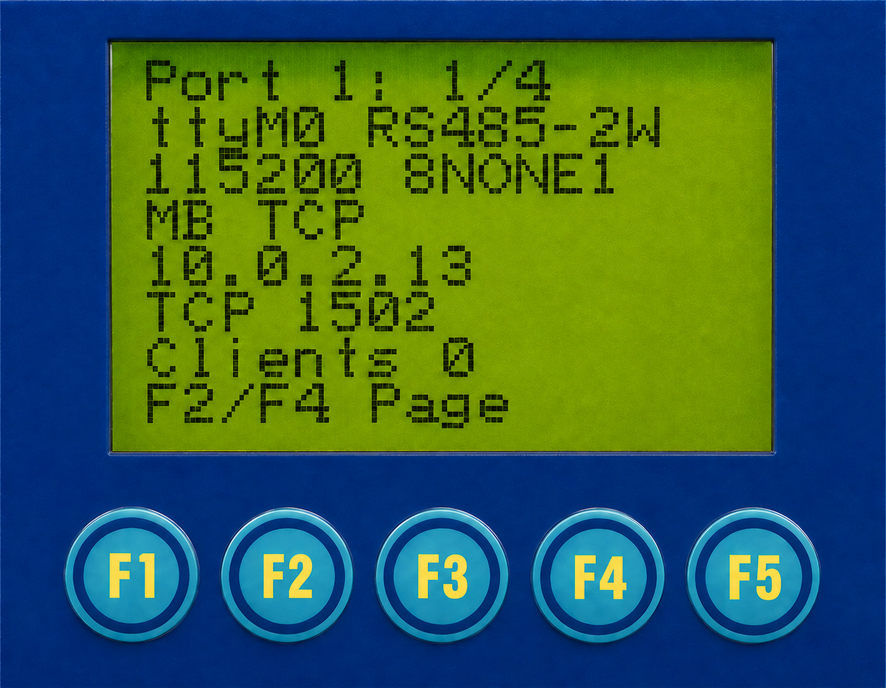
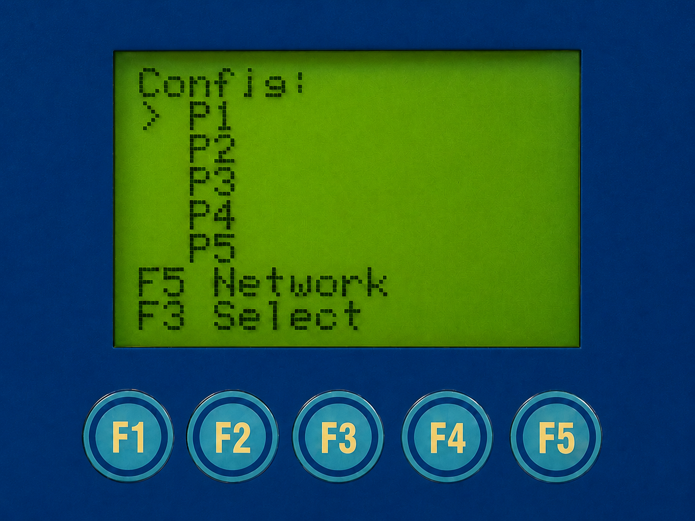
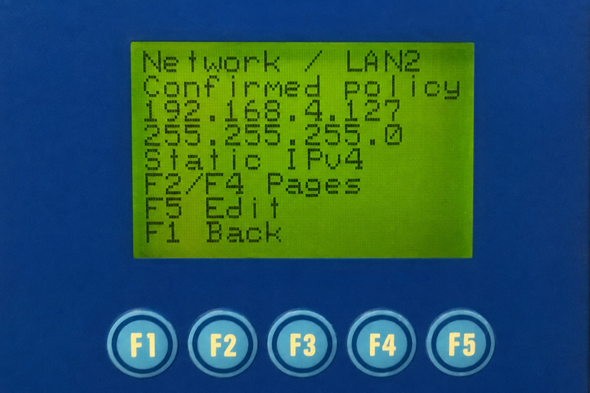
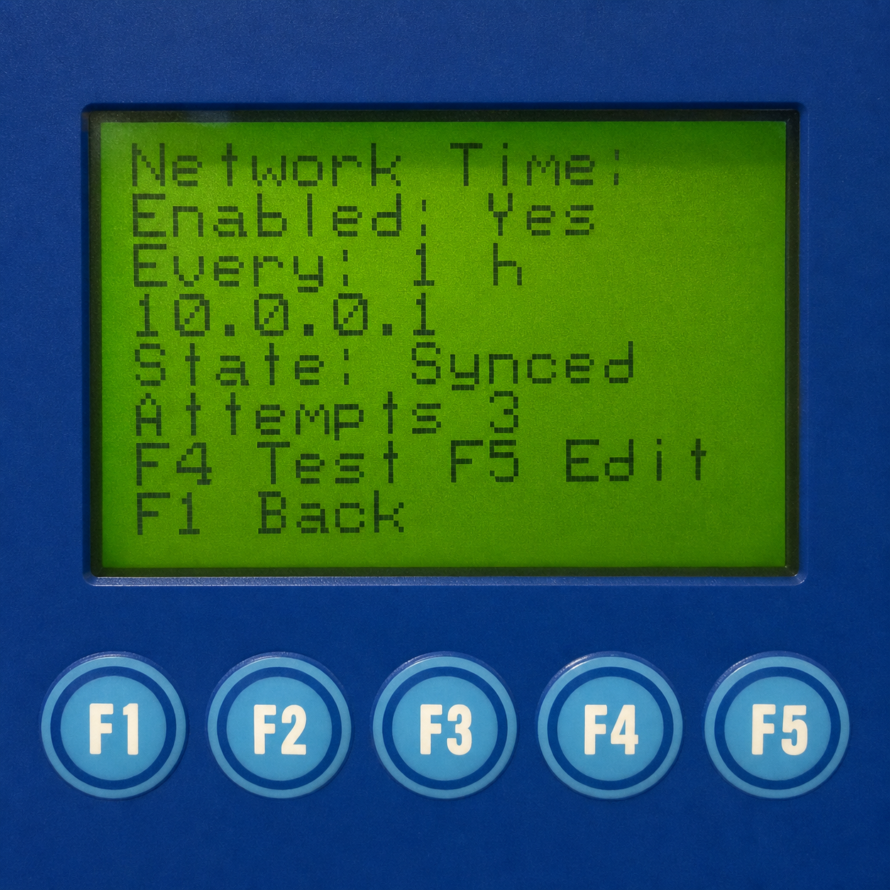
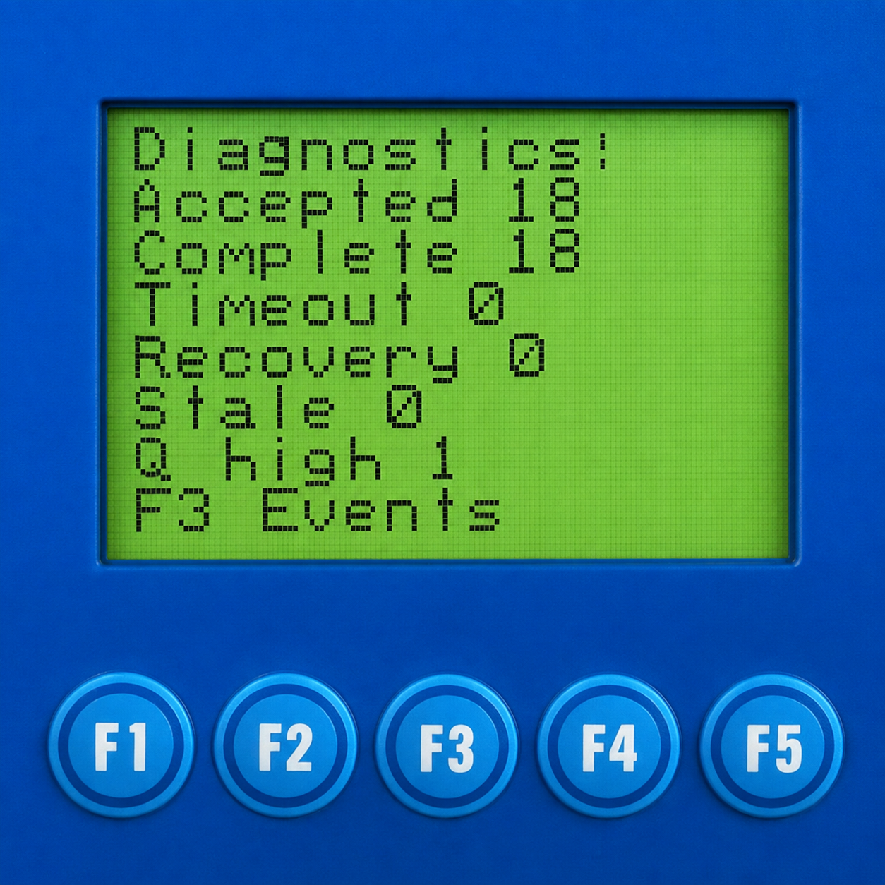
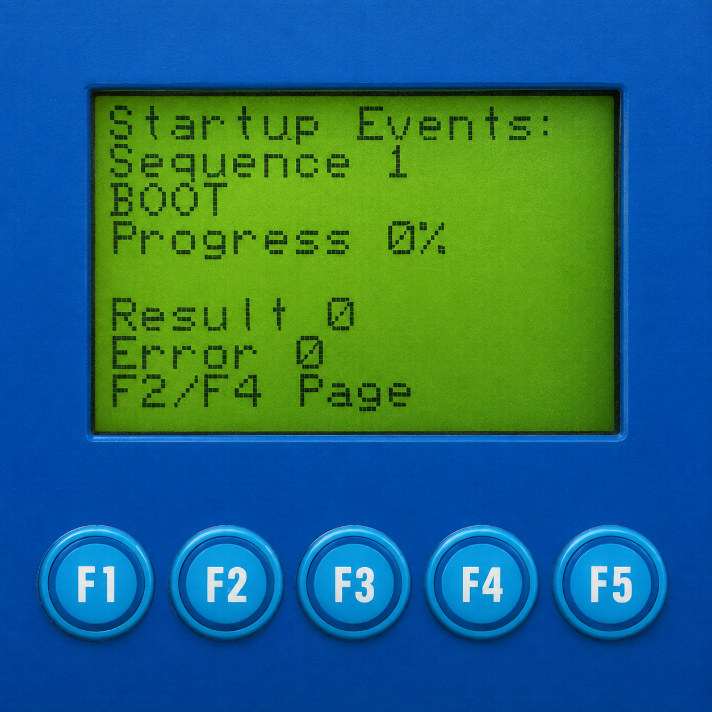

# 4VRS Gateway

**Modbus and transparent serial gateway for Moxa UC-7420-LX Plus.**

English · [Русский](README.ru.md) · [User guide](docs/user-guide.md)

Eight independently configurable RS-232 / RS-485 / RS-422 ports, managed from
the device's own display and keys. Runs on the existing Moxa Linux system;
the kernel and drivers remain in place.

**Status:** the first public release, `v2026.00.01`, is in preparation.
We are completing final testing and preparing the installation package and user documentation.

## Features

| Capability | Implementation |
| --- | --- |
| Serial | Independent P1–P8 settings; RS-232, RS-485 2/4-wire, RS-422 |
| Modbus TCP | MBAP-framed TCP requests bridged to serial Modbus RTU |
| Modbus UDP | MBAP-framed UDP requests bridged to serial Modbus RTU |
| RTU over UDP | RTU frames, including CRC, in UDP datagrams |
| RAW TCP / RAW UDP | Transparent serial data transport without Modbus interpretation |
| Local management | LCD/keypad settings, port states, counters and diagnostics |
| Network | LAN1/LAN2 static IPv4 or DHCP client, mask, default route, DNS |
| Network changes | Review, temporary Apply, explicit Keep, manual/timed Revert |
| Clock | RTC, NTP, 1/6/24-hour intervals, three-attempt diagnostic mode |
| Persistence | Saved product settings and confirmed network policy restored at startup |

Your software connects to Gateway over the network using TCP or UDP. Gateway
passes requests to the connected instrument over RS-232, RS-485 or RS-422 and
returns its replies to the software. Select the same transport in Gateway and
your software: **Modbus TCP, Modbus UDP, RTU over UDP, RAW TCP or RAW UDP**.
Their connection and data-framing rules are described in the table above.

**Planned for the second release:**

- A web interface for configuring and managing Gateway.
- An automatic Gateway firmware update module.

## Display and local menu

*Home screen.*

Home shows application readiness, ready ports, errors and clients. In this
example all eight enabled ports are ready, with zero errors and zero clients.
Port readiness is not proof of an instrument response. **F1 Help** opens help;
**F3 Menu** opens the main menu. Follow the bottom-line key prompts as you move
between settings. See the [user guide](docs/user-guide.md) for port configuration,
network Apply/Keep/Revert and NTP.

*Main menu.*

Use **F2/F4** to move, **F3** to open a section and **F1** to return.

| Section | Purpose |
| --- | --- |
| Status | Application status |
| Ports | Individual port states and counters |
| Configuration | Serial/transport settings and access to network settings |
| Diagnostics | Diagnostics and startup events |
| System | Date/time, platform information and NTP |
| Shutdown | Stop Gateway; does not power off the Moxa OS |
| About | Product and version information |

### Port status

*Port list.*

Use F2/F4 to select among P1–P8; the list scrolls to reveal the remaining
ports. **F3 Detail** opens the selected port's status pages. `READY` describes
the port runtime, not a confirmed response from a connected instrument.

*Port connection settings.*

The first detail page shows UART, serial mode/framing, transport and listener.
Here P1 uses `ttyM0`, RS485-2W, 115200 baud and Modbus TCP on port 1502.
`8NONE1` means 8 data bits, no parity and 1 stop bit (8N1). These are example
settings, not the factory defaults. F2/F4 cycle through the four detail pages.

### Configuration and network

F2/F4 select a port; **F3 Select** opens its configuration. **F5 Network**
opens the LAN, default-route and DNS pages.

*LAN2 network settings.*

**Confirmed policy** shows accepted settings. F2/F4 switch pages, F5 opens
the editor and F1 returns. Changes use Review → Apply → Keep, with Revert
available during the confirmation window. See the [network instructions](docs/user-guide.md#network-settings).

### Clock and NTP

Open **System → F5 Network Time** to view synchronization status and settings.
**F5 Edit** changes the NTP settings. Choose a normal interval of 1, 6 or 24 hours;
the default is 1 hour. **F4 Test** starts three attempts at one-minute intervals,
then automatically returns to the configured schedule.

*Network time settings.*

### Diagnostics

*Diagnostics counters.*

Open **Main Menu → Diagnostics** to view accepted and completed requests,
timeouts, recoveries, stale responses and the queue high-water mark.
**F3 Events** opens startup events.

*Startup events.*

Use **F2/F4** to browse events. Each entry shows its sequence, startup stage,
progress, result and error. `BOOT / Progress 0%` describes the selected startup
event, not the application's current readiness.

## Compatibility and installation

Hardware-tested: **Moxa UC-7420-LX Plus**, legacy XScale big-endian Linux.
**UC-7410-LX Plus** and other UC-74xx variants are related models, but have not
been hardware-qualified. The family name is not a tested-device list.

Product files and configuration use CompactFlash under `/var/hda/4vrs/`.
Minimal startup integration remains on internal storage.

The public installation package is still being prepared. An isolated development
binary does not include the required network and clock startup integration.
Installation instructions and assets will be published in
[Releases](https://github.com/dk-1983/moxa-4vrs-gateway/releases).

Read the [user guide](docs/user-guide.md) for operating an installed system.
Initial migration retains supported existing device settings and network addresses.

## New-configuration defaults

These are defaults for a new product configuration, not a device-reset instruction.

| Setting | Default |
| --- | --- |
| P1–P8 | Enabled, RS-232, 9600 baud, 8N1 |
| Transport | Modbus TCP |
| Listener | `0.0.0.0`, ports 502–509 respectively |
| NTP | Disabled; normal interval 1 hour |
| Network preference | Static IPv4; optional DHCP client, no DHCP server |

Network enrollment imports supported existing settings. It does not assign a
universal factory IP or silently convert existing DHCP settings to static.

## Development and verification

C source targets ARMv5TE/XScale big-endian using the separate legacy Moxa
toolchain. See the [build environment](docs/architecture/build-environment.md).
Vendor firmware, toolchains and manuals are not redistributed with this project.

Verification combines host regressions, selected UBSan tests, target ABI audits
and device experiments. See the [validation status](docs/validation.md)
for passed cases and remaining qualification. Component tests, TCP connections
and instrument transactions prove different scopes.

Versions follow [`vYEAR.RELEASE.PATCH`](docs/versioning.md), with a one-time initial-version exception:
first public release `v2026.00.01`, next 2026 feature release `v2026.01.00`.
Development candidate names are not published releases.

## Contributing and license

[Issues](https://github.com/dk-1983/moxa-4vrs-gateway/issues) welcome reproducible
problems and suggestions. Include model, version, transport, serial settings
and sanitized logs. See [CONTRIBUTING.md](CONTRIBUTING.md) and [SECURITY.md](SECURITY.md).

Original code and documentation use the [MIT License](LICENSE). See
[THIRD_PARTY.md](THIRD_PARTY.md) for vendor boundaries. This independent project
is not an official Moxa firmware release.
