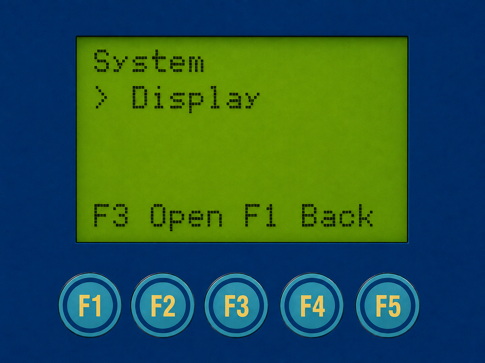
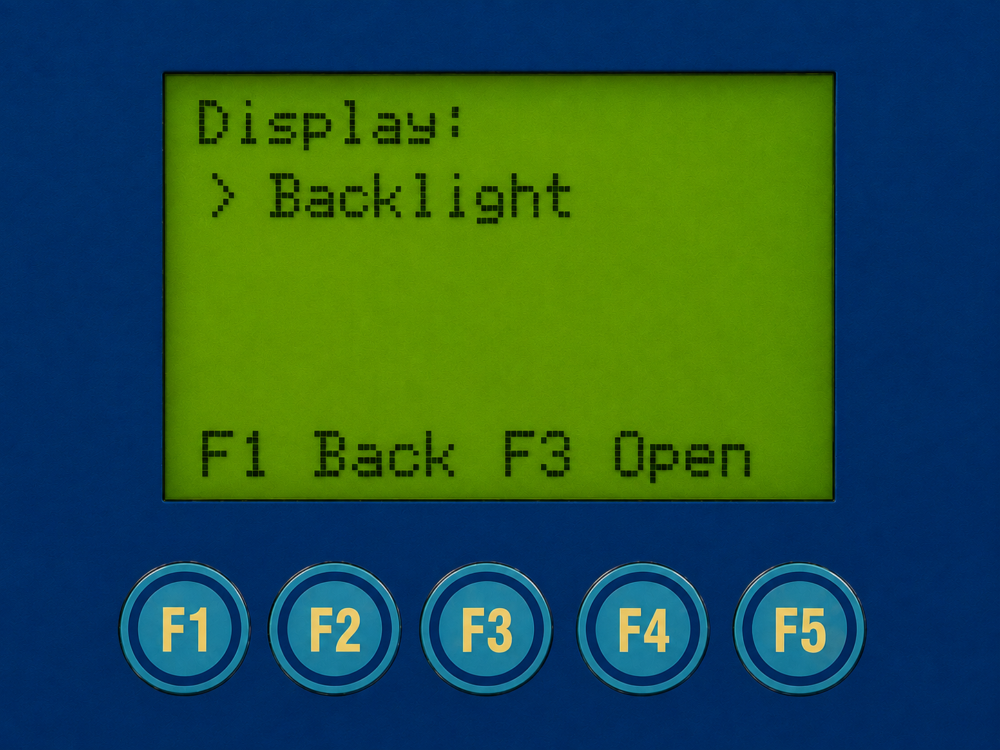
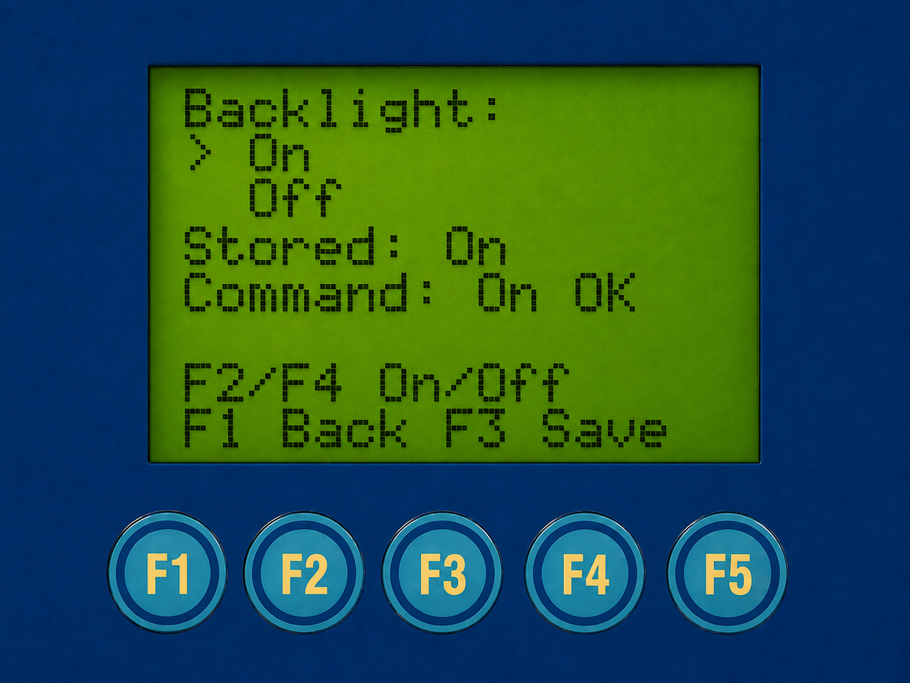

# Display backlight

[Русский](backlight.ru.md) · [User guide](user-guide.md)

Open **System → Display → Backlight → On / Off**. F4 advances the System pages
to Display; F3 opens Display and then Backlight. F2/F4 select; **F3 saves**.
F1 returns without saving the highlighted choice. Default On; old configs
without the option also default On. Saved Off returns at startup.

Only the light is switched: display contents and keys remain active, so return
through the same menu to On. A failed hardware command is reported, not shown
as successful application. Status is command acknowledgement, not invented
hardware readback. This operation does not restart UART, network or Gateway.
Older decoders cannot read the optional Off field; review active and backup
configuration before any downgrade. See [validation](validation.md) for evidence.

<table>
<tr>
<td valign="top">

</td>
<td valign="top">
<strong>Menu path</strong>
<pre>Home screen
└── F3 → Main Menu
   └── F3 → System
      └── <b>▶ F4 × 2 → Display</b></pre>
</td>
</tr>
</table>

*System: Display.*

<table>
<tr>
<td valign="top">

</td>
<td valign="top">
<strong>Menu path</strong>
<pre>Home screen
└── F3 → Main Menu
   └── F3 → System
      └── F4 × 2 → Display
         └── <b>▶ F3 → Display</b></pre>
</td>
</tr>
</table>

*Display menu.*

<table>
<tr>
<td valign="top">

</td>
<td valign="top">
<strong>Menu path</strong>
<pre>Home screen
└── F3 → Main Menu
   └── F3 → System
      └── F4 × 2 → Display
         └── F3 → Display
            └── <b>▶ F3 → Backlight</b></pre>
</td>
</tr>
</table>

*Backlight settings.*
