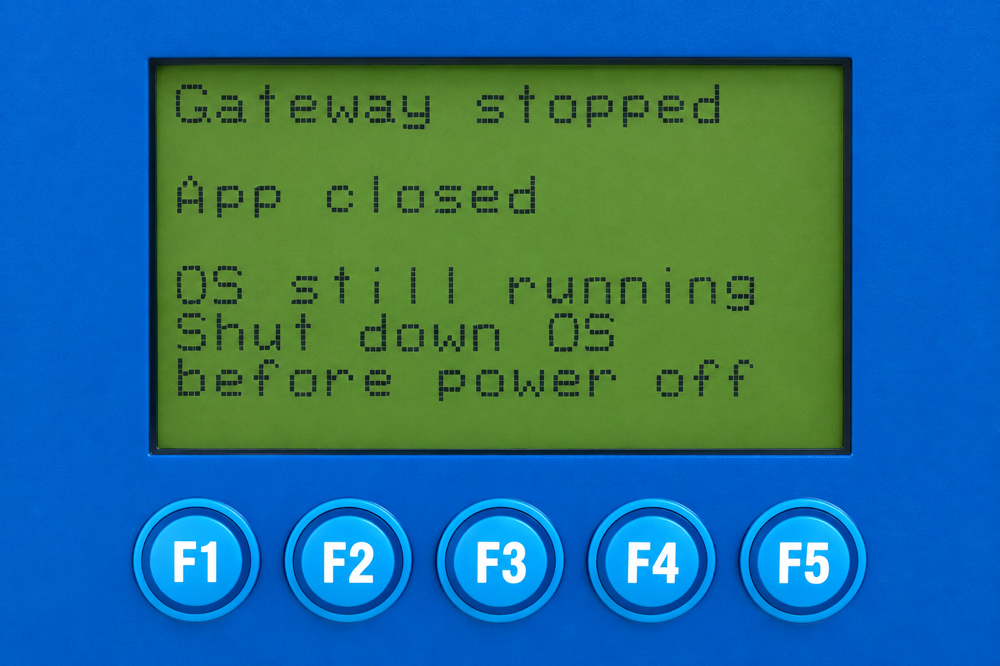

# Gateway shutdown — v2026.02.03

<table><tr><td width="60%"></td><td><pre>Home
└── F3 Main Menu
    └── Shutdown
        ├── F1 Cancel
        └── F3 YES
            ├── Stopping Gateway
            ├── Gateway stopped
            └── Shutdown failed
                └── F1 Back → Main Menu</pre></td></tr></table>

The illustration is rendered from an actual device photograph. The [original photograph](../../assets/images/screenshots/lcd-gateway-stopped-v2026.02.03-original.png) is retained as evidence.

`Gateway stopped` means the application has stopped; Linux is still running. Shut down the OS before removing power. `Shutdown failed` displays a reason and offers F1 Back. Returning to the menu does not restart stopped ports; status and diagnostics remain available, while settings changes are blocked.

No Web menu entries are added. System → Stop Gateway retains its existing confirmation and cancellation. The Web response acknowledges the request, not successful completion; disconnection is not proof of success. Inspect the final result on the LCD.

[Validation](v2026.02.03-validation.md) · [Русский](v2026.02.03-lcd.ru.md)
