# LCD and Web: screens and menu paths

Image on the left, menu path on the right. Browser chrome removed by exact cropping; retained pixels preserved. Illustrations explain navigation, not hardware acceptance. Example values are not defaults.

Missing-screen list closed: current LCD Web Server, Web System / Web Server and Security added; RU/EN rendering verified. Superseded images remain excluded. [Details](missing-current-screens.md).

## LCD — home

<table><tr><td></td><td><pre>Home (F3 → Main Menu) ←</pre></td></tr></table>

## LCD — main-menu

<table><tr><td></td><td><pre>Home
└─ Main Menu (F3) ←</pre></td></tr></table>

## LCD — ports

<table><tr><td></td><td><pre>Main Menu
└─ Ports ←</pre></td></tr></table>

## LCD — port-details

<table><tr><td></td><td><pre>Main Menu
└─ Ports
   └─ P1 ←</pre></td></tr></table>

## LCD — configuration

<table><tr><td></td><td><pre>Main Menu
└─ Configuration ←</pre></td></tr></table>

## LCD — network-lan2

<table><tr><td></td><td><pre>Main Menu
└─ Configuration
   └─ Network (F5)
      └─ LAN2 ←</pre></td></tr></table>

## LCD — network-time

<table><tr><td></td><td><pre>Main Menu
└─ System
   └─ Network Time ←</pre></td></tr></table>

## LCD — diagnostics

<table><tr><td></td><td><pre>Main Menu
└─ Diagnostics ←</pre></td></tr></table>

## LCD — startup-events

<table><tr><td></td><td><pre>Main Menu
└─ Diagnostics
   └─ Startup Events ←</pre></td></tr></table>

## LCD — system-display

<table><tr><td></td><td><pre>Main Menu
└─ System
   └─ Display ←</pre></td></tr></table>

## LCD — display-menu

<table><tr><td></td><td><pre>Main Menu
└─ System
   └─ Display
      └─ Backlight ←</pre></td></tr></table>

## LCD — backlight-on

<table><tr><td></td><td><pre>Main Menu
└─ System
   └─ Display
      └─ Backlight → On ←</pre></td></tr></table>

## LCD — web-system-menu

<table><tr><td><a href="../assets/images/menu/web/web-system-menu.png">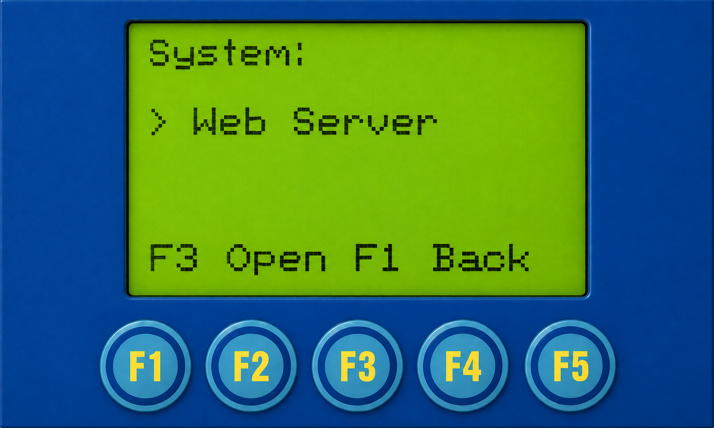</a></td><td><pre>Main Menu
└─ System
   └─ Web Server ←</pre></td></tr></table>

## LCD — web-https-addresses

<table><tr><td><a href="../assets/images/menu/web/web-https-addresses.png">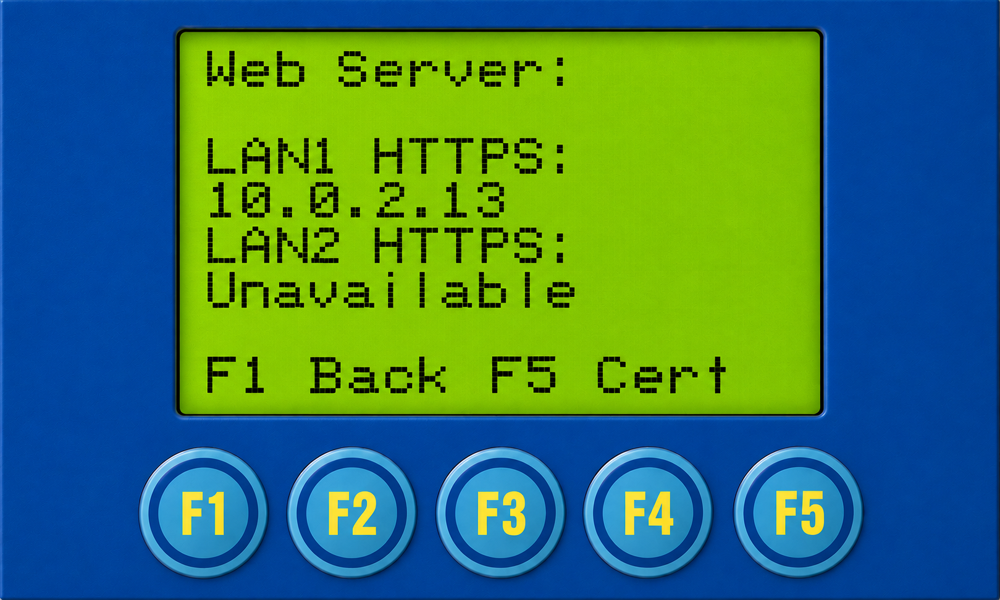</a></td><td><pre>Main Menu
└─ System
   └─ Web Server
      └─ URLs (F5) ←</pre></td></tr></table>

## LCD — web-certificate

<table><tr><td><a href="../assets/images/menu/web/web-certificate.png">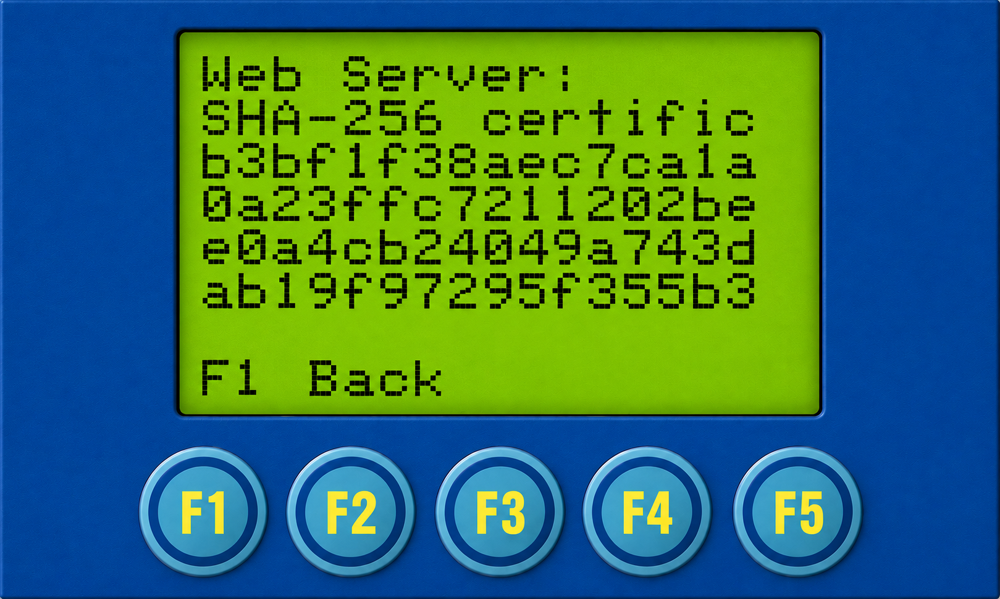</a></td><td><pre>Main Menu
└─ System
   └─ Web Server
      └─ URLs (F5)
         └─ Cert (F5) ←</pre></td></tr></table>

## Web — web-sign-in-security-help-ru

<table><tr><td><a href="../assets/images/screenshots/web-v2026.02.01-public/web-sign-in-security-help-ru.png">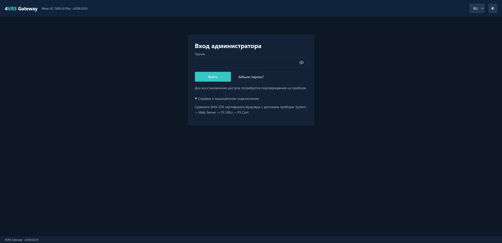</a></td><td><pre>Web
└─ Вход администратора
   └─ Справка о соединении ←</pre></td></tr></table>

## Web — web-overview-en

<table><tr><td><a href="../assets/images/screenshots/web-v2026.02.01-public/web-overview-en.png">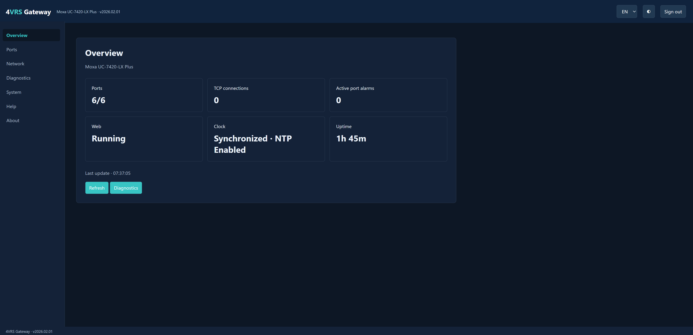</a></td><td><pre>Web
└─ Overview ←</pre></td></tr></table>

## Web — web-ports-en

<table><tr><td><a href="../assets/images/screenshots/web-v2026.02.01-public/web-ports-en.png">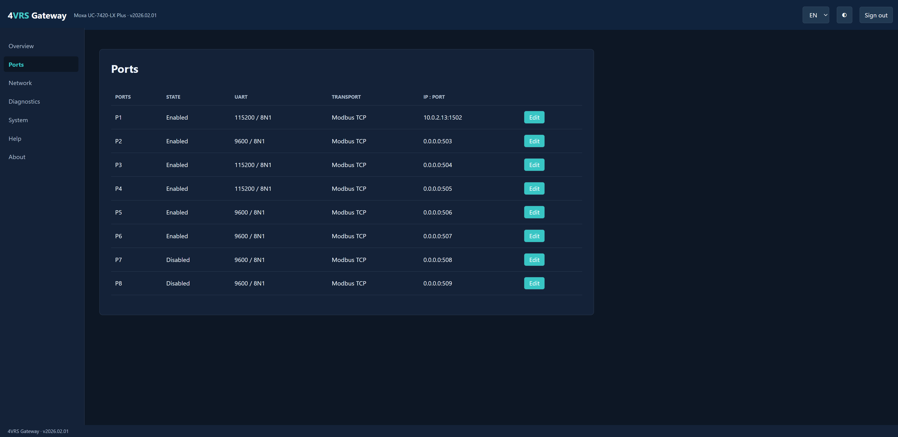</a></td><td><pre>Web
└─ Ports ←</pre></td></tr></table>

## Web — web-port-p1-settings-en

<table><tr><td><a href="../assets/images/screenshots/web-v2026.02.01-public/web-port-p1-settings-en.png">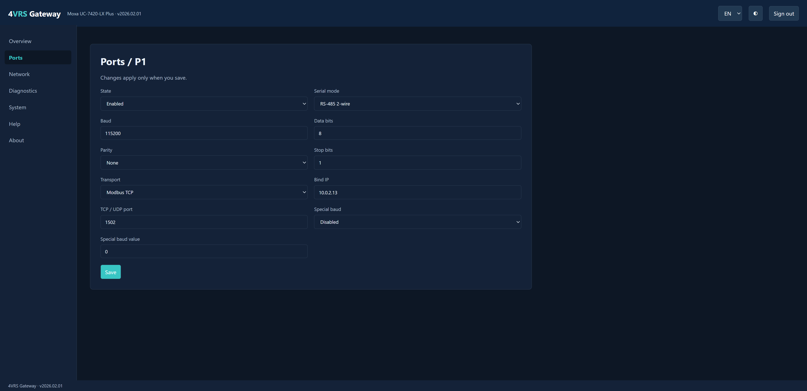</a></td><td><pre>Web
└─ Ports
   └─ P1 → Settings ←</pre></td></tr></table>

## Web — web-network-settings-en

<table><tr><td><a href="../assets/images/screenshots/web-v2026.02.01-public/web-network-settings-en.png">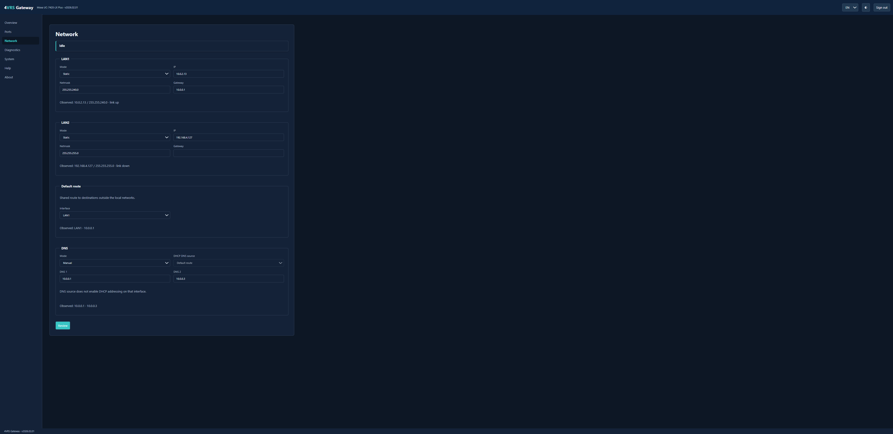</a></td><td><pre>Web
└─ Network ←</pre></td></tr></table>

## Web — web-diagnostics-startup-events-en

<table><tr><td><a href="../assets/images/screenshots/web-v2026.02.01-public/web-diagnostics-startup-events-en.png">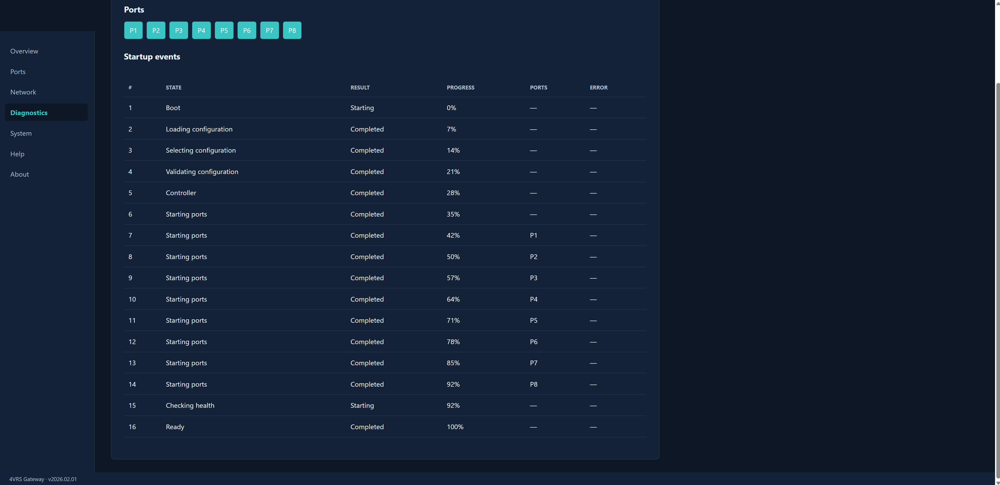</a></td><td><pre>Web
└─ Diagnostics
   └─ Startup Events ←</pre></td></tr></table>

## Web — web-diagnostics-port-p1-en

<table><tr><td><a href="../assets/images/screenshots/web-v2026.02.01-public/web-diagnostics-port-p1-en.png">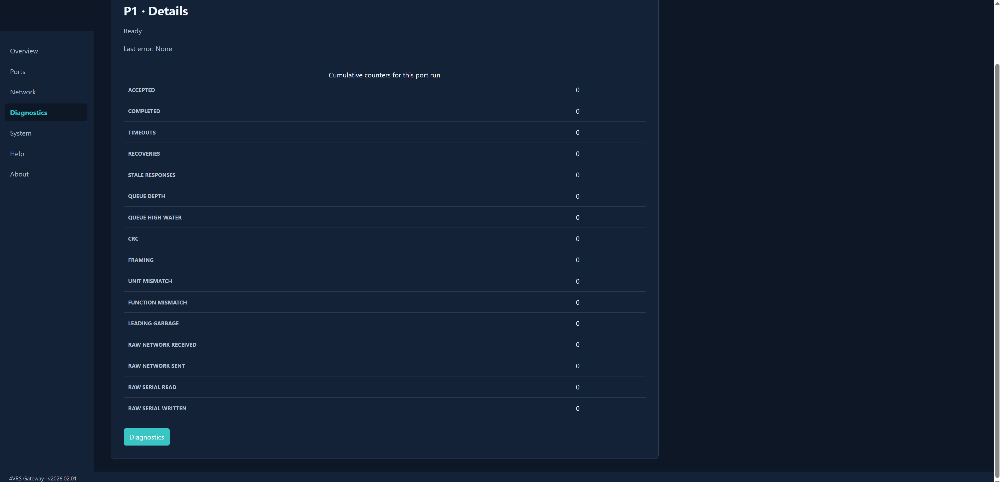</a></td><td><pre>Web
└─ Diagnostics
   └─ P1 ←</pre></td></tr></table>

## Web — web-help-en

<table><tr><td><a href="../assets/images/screenshots/web-v2026.02.01-public/web-help-en.png">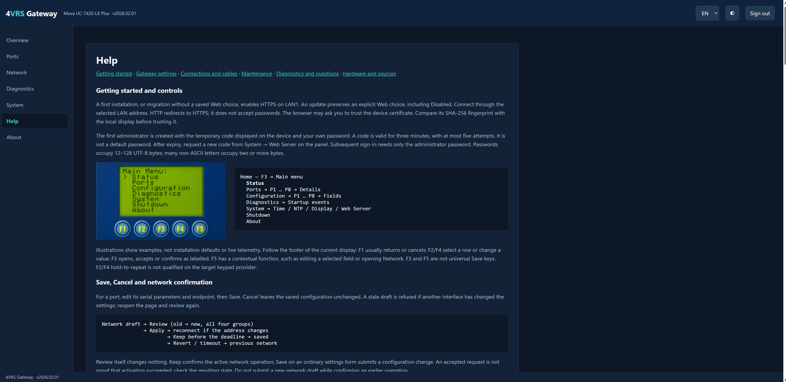</a></td><td><pre>Web
└─ Help ←</pre></td></tr></table>

## Web — web-about-en

<table><tr><td><a href="../assets/images/screenshots/web-v2026.02.01-public/web-about-en.png">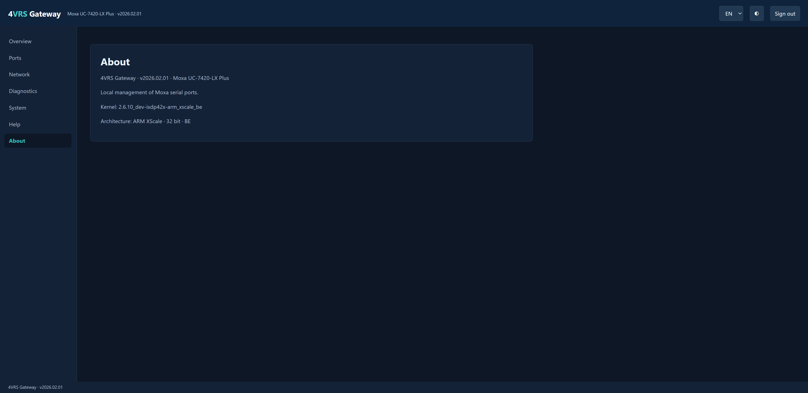</a></td><td><pre>Web
└─ About ←</pre></td></tr></table>

## LCD — web-server-http

<table><tr><td></td><td><pre>Main Menu
└─ System
   └─ Web Server
      └─ HTTP cleartext ←</pre></td></tr></table>

## Web — web-system-web-server-http-en

<table><tr><td></td><td><pre>Web
└─ System
   └─ Web Server
      └─ Protocol: HTTP ←</pre></td></tr></table>

## Web — web-system-security-password-en

<table><tr><td><a href="../assets/images/screenshots/web-v2026.02.01-public/web-system-security-password-en.png">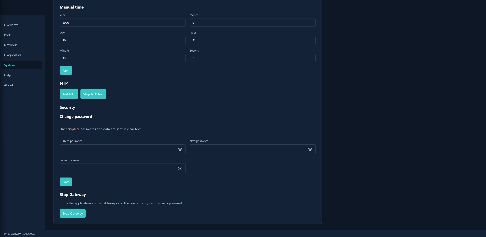</a></td><td><pre>Web
└─ System
   └─ Security
      └─ Change password ←</pre></td></tr></table>
