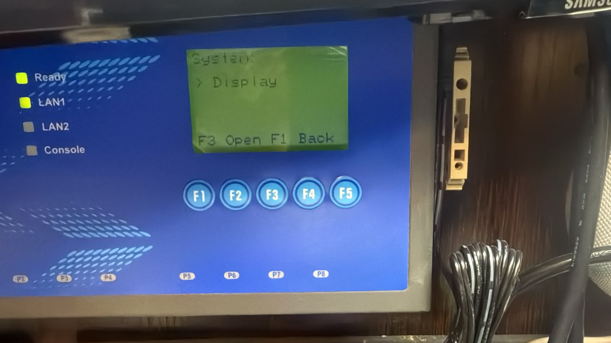
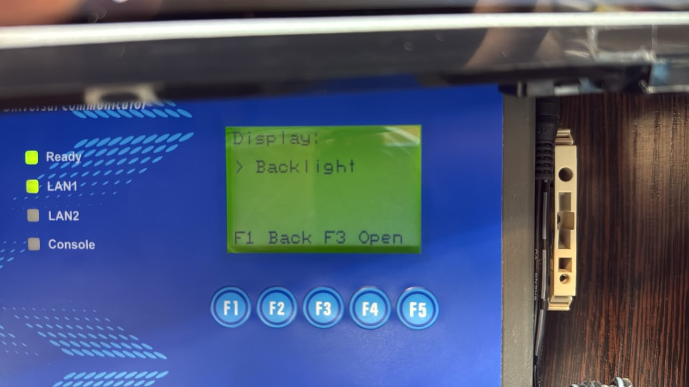
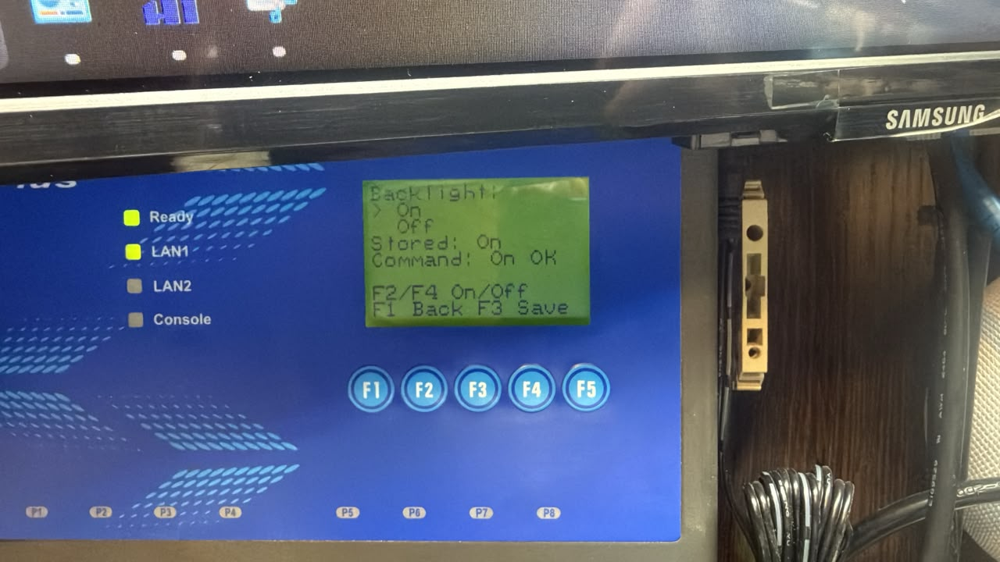

# 4VRS Gateway user guide

[README](../README.md) · [Русский](user-guide.ru.md)

User guide for release **v2026.01.00**. This guide describes the 4VRS Gateway project.
For the device's technical, electrical and other specifications, consult the
manufacturer's instructions.

## Automatic installation

The native installer runs on supported Moxa UC-7420-LX Plus Linux systems.
It preserves the device's own network, serial and NTP configuration, prepares
the network/clock scripts and manages services/startup. It needs no Python on
the Moxa, no manual enroll and no hand-written vendor derivative. It does not
reboot automatically and is not a vendor firmware image.

Arrange a maintenance window and recovery access; installation can interrupt
SSH and serial traffic. Preserve an external baseline of this device's settings
and startup files. Check target identity and actual mounted CF before proceeding.
Unsupported layouts are refused; do not bypass the refusal. Read the
[documented scope and deferred tests](validation.md) before first deployment.
Run each command separately and stop if it fails. Do not disable SSH host-key checks.

## Download and copy

**Computer — PowerShell**, in a download directory:
```powershell
Invoke-WebRequest -Uri 'https://github.com/dk-1983/moxa-4vrs-gateway/releases/download/v2026.01.00/4vrs-gateway-v2026.01.00.tar.gz' -OutFile './4vrs-gateway-v2026.01.00.tar.gz'
Invoke-WebRequest -Uri 'https://github.com/dk-1983/moxa-4vrs-gateway/releases/download/v2026.01.00/SHA256SUMS' -OutFile './SHA256SUMS'
Get-FileHash -Algorithm SHA256 './4vrs-gateway-v2026.01.00.tar.gz'
$moxaAddress = Read-Host 'Moxa IP'
$moxaSshPort = [int](Read-Host 'SSH port')
ssh -p $moxaSshPort "root@$moxaAddress"
```

Require package SHA256 `852ba0816c467bb828fa9f15c07ee0e7e4a62cfb8b3e7446ef0a69bae9d4cc3f`
and size225462 bytes. SHA256SUMS covers the public archive, not the older release's ELF.

**Moxa — SSH:** require root, mounted CF at `/var/hda`, free space and the correct
device. The parent `/var/hda/4vrs/tests` must exist; for a first deployment create
it with `mkdir -p /var/hda/4vrs/tests` only after verifying CF is mounted.
Create a fresh staging directory; if it already exists, inspect it instead of overwriting:
```sh
id
mount
df -k /etc /var/hda
test ! -e /var/hda/4vrs/tests/install-v2026.01.00
mkdir -m 700 /var/hda/4vrs/tests/install-v2026.01.00
```

**Computer — PowerShell**, in the same shell holding the address/port variables:
```powershell
scp -P $moxaSshPort ./4vrs-gateway-v2026.01.00.tar.gz ./SHA256SUMS "root@${moxaAddress}:/var/hda/4vrs/tests/install-v2026.01.00/"
```

## Install and read the result

**Moxa — SSH:** require archive MD5 `924d60987086c31534ce046282b4c7c2`
after transfer before unpacking. Tar preserves executable modes; do not unpack
on Windows and upload mode-less files. Execute only the complete original package:
```sh
cd /var/hda/4vrs/tests/install-v2026.01.00
md5sum 4vrs-gateway-v2026.01.00.tar.gz
tar -xzf 4vrs-gateway-v2026.01.00.tar.gz
cd 4vrs-gateway-v2026.01.00
./4vrs-install
```

`operation started` means a detached worker was launched, not successful completion.
After reconnecting to the same device, read the persistent result:
```sh
cd /var/hda/4vrs/tests/install-v2026.01.00/4vrs-gateway-v2026.01.00
./4vrs-install --status
```

| result | Meaning |
| --- | --- |
| 0 | Completed operation; check stage (normally verify-installed; recovery repair may report repair-recovery-executable) |
| 3 | Healthy already installed/no transaction; no unnecessary service restart |
| 100 | Last worker record was running; may be stale after interruption/boot |
| 1 | Previous installation restored; requested update did not complete |
| 2 | Waiting for CF; do not bypass startup protection |
| -1 | Refused preparation/input; inspect stage/detail |
| -2 | Recovery required or incomplete; not a successful install |

`--status` exit0 means the record was read. Inspect result/stage, retained settings
and application readiness; TCP connection alone is not an instrument read.
To repeat a healthy installation run `./4vrs-install` from that package directory.
The installer preserves configuration; it does not copy another device's IPs.

## Interruption and recovery

Retain journals, gates, locks and network store. Do not erase them to force a retry.
The independent recovery executable works before CF becomes available:
```sh
/etc/4vrs-installer/recovery --recover
/etc/4vrs-installer/recovery --status
```

Read status after the asynchronous operation. If recovery has not yet been
published, rerun the same verified package; bootstrap had not changed the old
startup entries at that point. For WAIT_CF restore availability using an agreed
safe procedure, then retry recovery; do not manufacture a mount or hot-remove CF.
Boot entries also recover unfinished transactions. The old worker result100 can
persist after successful boot recovery; compare actual restored set/services.
Application startup waits up to120 seconds for CF; later recovery/start may need
an explicit retry. Corrupt journals require diagnosis via reserve access, not bypass.
Recovery rolls back an unfinished transaction; it is not a general downgrade command.

## Backlight and retained manual procedure

**System → Display → Backlight → On / Off**, F3 saves. Default On; old configs
without the field use On. Off retains screen/key handling and returns after boot.
See [Backlight](backlight.md). Older decoders cannot read an Off configuration or
backup: a binary downgrade needs separate compatibility review.

<table>
<tr>
<td valign="top">

</td>
<td valign="top">
<strong>Menu path</strong>
<pre>Home screen
└── F3 → Main Menu
   └── F3 → System
      └── <b>▶ F4 × 2 → Display</b></pre>
</td>
</tr>
</table>

*System: Display.*

<table>
<tr>
<td valign="top">

</td>
<td valign="top">
<strong>Menu path</strong>
<pre>Home screen
└── F3 → Main Menu
   └── F3 → System
      └── F4 × 2 → Display
         └── <b>▶ F3 → Display</b></pre>
</td>
</tr>
</table>

*Display menu.*

<table>
<tr>
<td valign="top">

</td>
<td valign="top">
<strong>Menu path</strong>
<pre>Home screen
└── F3 → Main Menu
   └── F3 → System
      └── F4 × 2 → Display
         └── F3 → Display
            └── <b>▶ F3 → Backlight</b></pre>
</td>
</tr>
</table>

*Backlight settings.*

The [retained manual procedure](user-guide.md#manual-installation-of-v20260001)
describes the previous manually integrated release. Do not run it over this
installer's active journal or substitute old binaries into this package.
Its command checklist and operating instructions remain below the automatic path.

## Manual installation of v2026.00.01

Command blocks identify where they run: **computer — PowerShell**,
**computer — Linux** or **Moxa — SSH**. Run one command at a time and check its
result before continuing. Stop on an error instead of proceeding to the next step.

### Release contents

Open the [v2026.00.01 release page](https://github.com/dk-1983/moxa-4vrs-gateway/releases/tag/v2026.00.01).
Download `4vrs-gateway` and `SHA256SUMS`. The **Source code** archive contains
project sources and scripts, including `deploy`.

`4vrs-gateway` runs on the existing Moxa UC-7420-LX Plus Linux system. It is
not an operating-system image and must not be submitted to the vendor firmware
upgrade function. Installation in this release is manual; there is no automatic
installer. First installation integrates application startup, network recovery
and clock management.

### 1. Verify the download

The executable is **201665 bytes**, with SHA256:

```text
68479273620832902e400e1b42d5566cf7c363c9816c7faab464b26640630731
```

In PowerShell, from the download directory:

```powershell
Get-FileHash -Algorithm SHA256 -LiteralPath './4vrs-gateway'
```

In Linux, from that directory:

```sh
sha256sum -c SHA256SUMS
```

If the checksum differs, download the file again before installation.

**Computer — PowerShell.** Also check the file size:

```powershell
(Get-Item -LiteralPath './4vrs-gateway').Length
```

Expected result: `201665`. Verify the checksum before transfer and again after
copying the file to the Moxa.

### 2. Prepare the device

Connect to the Moxa's current address over SSH with root privileges. Working
CompactFlash, application storage space and write access to the persistent `/etc`
area are required. Check the model and preserve the device's network, serial and
clock settings. For initial integration, prepare console access in case the
network connection is interrupted.

Capture `/etc/network/interfaces`, `/etc/resolv.conf`, the actual target of
`/etc/rc.d/rcS.d/S40networking`, `/etc/init.d/ntpdate`, `/etc/init.d/ntpdate.d`,
`/etc/init.d/halt` and existing clock synchronization jobs. If Gateway is already
installed, also preserve its configuration, `/etc/4vrs-network` and executables.
Verify script locations on your system; do not substitute files from another
unit. Installation retains the existing network address.

**Computer — PowerShell.** Enter this Moxa's current IP and SSH port:

```powershell
$moxaAddress = Read-Host 'Moxa IP'
$moxaSshPort = [int](Read-Host 'SSH port')
ssh -p $moxaSshPort "root@$moxaAddress"
```

After login, run these commands **on the Moxa — SSH**:

```sh
id
uname -a
mount
df -k /etc /var/hda
ls -l /etc/rc.d/rcS.d/S40networking
```

Confirm `uid=0`, that CompactFlash is actually mounted at `/var/hda`, and that
storage is available. `ls` shows the network boot entry and its target if it is
a symlink. If the entry is missing or CF is unmounted, stop before copying files
to system directories and inspect that system's boot chain. These commands do
not change settings.

### 3. Place the files

Transfer the binary into a separate staging directory on CompactFlash and verify
its checksum after transfer. Do not overwrite a running executable. Stop other
applications using the same UARTs before starting Gateway.

| Component | Location |
| --- | --- |
| Application | `/var/hda/4vrs/bin/4vrs-gateway` |
| Application settings | `/var/hda/4vrs/config/gateway.conf` |
| Runtime files and startup log | `/var/hda/4vrs/run`, `/var/hda/4vrs/log` |
| Network recovery helper — identical binary | `/etc/4vrs-network/gateway-network-recovery` |
| Confirmed network configuration | `/etc/4vrs-network` |
| Application startup script | `deploy/4vrs-gateway.init` from the release sources |
| Network startup wrapper | `deploy/4vrs-networking-wrapper` from the release sources |

Executables require execute permission. Keep the recovery helper under `/etc`
because network recovery must work before CompactFlash becomes available.
Preserve an existing `gateway.conf`; do not replace it with example settings.
Without a saved configuration, the application uses the defaults described below.

### 4. Initial network and clock integration

An administrator performs this stage against the particular device's boot
scripts. This is a manual integration sequence, not a universal paste-and-run
installation script.

1. Preserve the device's original network script as
   `/etc/4vrs-network/vendor-networking`. On the computer, prepare a derivative
   using `tools/prepare-network-boot-migration.py` with the captured original's
   SHA256. The tool checks four supported ifup/ifdown call sites. A refusal
   requires review of that script; do not bypass the check.
2. Install the result as `/etc/4vrs-network/vendor-networking-managed`, retaining
   the other vendor hooks. Do not remove disconnected interfaces merely to make
   import succeed.
3. Only when no enrolled network store exists, import the current settings with
   `gateway-network-recovery --network-enroll /var/hda/4vrs/config`. Invoke the
   helper by its full path from the table. Expect `network-enroll ok stage=ok`.
   Existing stores must be preserved and checked for compatibility; repeating
   enroll is not an upgrade procedure. On failure, stop at the reported stage
   and retain the store for diagnosis.
4. Run the helper's `--network-boot` operation and expect
   `network-boot ok stage=ok`. Before editing policy, materialized addresses,
   masks, routes and DNS must match the device's original configuration.
5. Prepare clock changes from this device's captured vendor scripts with
   `tools/prepare-clock-writer-migration.py`. Review the diff and install the
   matching guards: while `/etc/4vrs-clock-managed` exists, vendor services must
   not compete with Gateway for NTP or RTC writes. Review cron and any other
   previously configured time writers separately.
6. Integrate `4vrs-networking-wrapper` in place of the verified early
   S40networking entry, preserving the original. Activate the
   `/etc/4vrs-network/enabled` marker only after the helper, store and vendor
   derivative are ready. The wrapper restores policy, runs the vendor phase
   and starts the network owner.
7. Integrate `4vrs-gateway.init` into normal startup **after** network recovery
   and `/var/hda` mounting. Start the application through that script. An already
   addressed loopback without a receipt requires a controlled network restart
   during initial integration; SSH may disconnect. Do not fabricate a receipt
   or ifstate, or hide a failure by repeating start.

Verify the exact boot-chain changes for the target system. Preparation tools
create files for review; they do not install the product. Do not enable managed
networking when an earlier step has failed.

### 5. Check the installation

Check the Home screen, **About → v2026.00.01**, port readiness and retained
LAN1/LAN2, route and DNS settings. If NTP is enabled, check **Synced**. Query an
attached instrument using its actual address and transport. Confirm that only
one application instance is running.

Perform a planned reboot and repeat checks of connectivity, automatic startup,
settings and instrument communication. This checks normal startup, not power
interruption during a configuration write.

### Existing Gateway installations

If both the application and recovery helper already match the SHA256 above,
they are the current release binary: no reinstall is needed for the version
number. When migrating from another build, review compatibility and prepare a
coherent replacement of application and helper. Do not repeat enroll, reset
settings or copy another unit's network files. A failed migration requires
restoring a consistent application/helper/configuration/startup set, not a
single arbitrarily selected older file.

## Menu tree

Names below match the display. In ordinary lists, **F2/F4** move the selection,
**F3** opens an item and **F1** returns. Follow the bottom-line prompts for editor actions.

```text
Home screen
├── F1 Help
└── F3 Main Menu
    ├── Status — application state
    ├── Ports
    │   └── P1 … P8 → F3 Detail
    │       └── F2/F4: connection → counters → errors → port state
    ├── Configuration
    │   ├── P1 … P8 → F3 Select
    │   │   ├── Port settings → F5 Edit
    │   │   ├── Save & Apply → confirmation → result
    │   │   └── Cancel changes
    │   └── F5 Network
    │       ├── F2/F4: LAN2 / LAN1 / route / DNS / Observed LAN1 / Observed LAN2
    │       └── F5 Edit → F5 Review → F3 Apply
    │           ├── F3 Keep — save
    │           └── F1 Revert / timer expiry — roll back
    ├── Diagnostics
    │   └── F3 Events → Startup Events → F2/F4: entries
    ├── System
    │   ├── Date & Time → F5 Set Time
    │   └── F4 Platform
    │       └── F5 Network Time
    │           ├── F5 Edit: enable, server, interval
    │           └── F4 Test / Stop: NTP diagnostics
    ├── Shutdown → confirm stopping Gateway
    └── About — product and version
```

## Operation and navigation

## Home screen

<table>
<tr>
<td valign="top">

</td>
<td valign="top">
<strong>Menu path</strong>
<pre><b>▶ Home screen</b></pre>
</td>
</tr>
</table>

*Home screen.*

Use the device's existing network address. A migration must retain its own
configuration; do not copy another Moxa's saved network profile.

On Home, **F3** opens the main menu and **F1** opens Help. The menu contains
Status, Ports, Configuration, Diagnostics, System, Shutdown and About.
The bottom screen lines show the keys available on the current page.
Usually F2/F4 move between choices, F3 selects and F1 goes back.

`READY` and `Ports … ready` describe application/port readiness. They do not
prove that an instrument answered. Check a real client transaction as well.
`Clients 0` simply means there is no counted client at that moment.

### Main menu

<table>
<tr>
<td valign="top">

</td>
<td valign="top">
<strong>Menu path</strong>
<pre>Home screen
└── <b>▶ F3 → Main Menu</b></pre>
</td>
</tr>
</table>

*Main menu.*

F2/F4 move the selection, F3 opens it and F1 returns to Home. Use Status for
application state, Ports for per-port counters, Configuration for settings,
Diagnostics for diagnostic information/startup events, System for the clock
and platform, and About for the version. Shutdown stops the application only.

## Serial ports and transports

Open **Configuration**, select a physical port, and review its fields. Match
serial mode, baud rate, data bits, parity and stop bits to the instrument.
Logical P1–P8 are tied to their physical UARTs. Confirm wiring using the device
documentation; Ethernet-style RJ45 connectors do not imply Ethernet signaling.

Select the field and use the displayed **F5 Edit** action. F2/F4 change a value;
follow the field's prompts to accept it. Complete the port's **Apply** and
confirmation steps to submit the configuration: the final field is
**Save & Apply**. **Cancel changes** abandons the draft.
A field edit alone is not a saved configuration.

Wait for **Config Result** after confirming Apply. `APPLYING...` is still in
progress. Plain `APPLIED` means the configuration transaction succeeded,
including persistence; `NO CHANGES` means there was nothing to change.
`INVALID / NOT APPLIED` rejects the draft. `FAILED / ROLLED BACK` reports a
failed change and rollback; `ROLLBACK FAILED` needs diagnosis. If `APPLIED`
is accompanied by `DURABILITY?`, persistence is uncertain: do not treat it as
a confirmed save across power loss. Record the result and diagnose storage.

| Panel transport | Client framing / purpose |
| --- | --- |
| MB TCP | Standard Modbus TCP with MBAP header |
| MB UDP | MBAP-framed Modbus in UDP |
| RTU/UDP | Complete Modbus RTU frames, including CRC, in UDP |
| RAW TCP | Transparent TCP byte stream to/from serial |
| RAW UDP | Transparent UDP-to-serial data exchange |

The Modbus modes bridge to serial RTU. The instrument address is the Modbus
unit address in the client's requests; the gateway's IP address is a different
setting. RAW transports do not turn arbitrary bytes into Modbus transactions.
Choose the same transport at both network endpoints.

The new-configuration defaults are RS-232, 9600, 8N1, Modbus TCP, all eight
ports enabled, network ports 502–509. Existing saved configurations can differ.
Select an appropriate listener address and an unused endpoint port. `0.0.0.0`
is a wildcard bind, not a destination address to enter in a client.

Under **Ports**, select a port to inspect its state and page through counters
and errors with F2/F4. An established TCP connection proves socket access;
a valid read response is needed to prove the complete instrument path.

### Inspecting ports

<table>
<tr>
<td valign="top">

</td>
<td valign="top">
<strong>Menu path</strong>
<pre>Home screen
└── F3 → Main Menu
   └── <b>▶ F3 → Ports</b></pre>
</td>
</tr>
</table>

*Port list.*

F2/F4 move through all eight ports, scrolling the five-row list as needed.
Press F3 Detail to inspect the selected port; F2/F4 then switch detail pages.
F1 returns to the list. This view reports status; it does not edit configuration.

<table>
<tr>
<td valign="top">

</td>
<td valign="top">
<strong>Menu path</strong>
<pre>Home screen
└── F3 → Main Menu
   └── F3 → Ports
      └── <b>▶ F3 → P1 → Detail</b></pre>
</td>
</tr>
</table>

*Port connection settings.*

In this example, `115200 8NONE1` means 115200 baud, 8 data bits, no parity,
1 stop bit. `TCP 1502` is the listener port, not the Modbus unit address.

The detail header shows the physical port and page number, for example
`Port 1: 1/4`. There are four pages:

| Page | Fields |
| --- | --- |
| 1/4 — Connection | UART (`ttyM0` is P1), serial mode, baud/framing, transport, bind address, TCP/UDP port and clients |
| 2/4 — Transactions | Accepted, Complete, Timeout, Recovery, current Queue and maximum observed High water |
| 3/4 — Protocol diagnostics | CRC and Frame errors, Unit/Function mismatches, leading Garbage and Stale responses |
| 4/4 — Runtime | Configuration Generation, Last ok and the runtime error text |

`Queue` is current depth; `High water` is the recorded peak. Counters describe
the selected runtime/transport and are not water-meter readings or persistent
instrument totals. Interpret Modbus-specific diagnostics in the context of
the selected transport. `Last ok` is a runtime timestamp, not a formatted
calendar time. A `!` beside a port in the list flags a recorded error; inspect
the details before deciding what caused it.

## Network settings

<table>
<tr>
<td valign="top">

</td>
<td valign="top">
<strong>Menu path</strong>
<pre>Home screen
└── F3 → Main Menu
   └── <b>▶ F3 → Configuration</b></pre>
</td>
</tr>
</table>

<table>
<tr>
<td valign="top">

</td>
<td valign="top">
<strong>Menu path</strong>
<pre>Home screen
└── F3 → Main Menu
   └── F3 → Configuration
      └── F5 → Network
         └── <b>▶ LAN2</b></pre>
</td>
</tr>
</table>

*Configuration menu and LAN2 network settings.*

From the main menu open **Configuration**, then **F5 Network** on the port list.
F2/F4 cycle through LAN2, LAN1, Default route, Global DNS, Observed LAN1 and
Observed LAN2. Use F5 Edit on a settings page.

**Confirmed policy** is what was accepted and saved. **Observed** shows the
live interface state. They answer different questions, especially under DHCP.
`Link down` on an Observed page means the interface is currently reported
without link; it is not a statement that the saved IP address was erased.

For a LAN, edit the IP octets, subnet-mask octets and static/DHCP mode. F3 moves
to the next field; F2/F4 change it. Set addresses appropriate to your own
network. DHCP is a client function: the gateway does not distribute addresses.
A router-side MAC reservation is configured on the DHCP server separately.

Default-route settings select no default route, LAN1 or LAN2 and the gateway
address. Global DNS selects manual servers or automatic DNS from one chosen
DHCP interface. DNS source and default-route interface are separate settings.
An expired DHCP lease is not retained as a valid static address.

### Apply, Keep and Revert

1. Finish editing and press **F5 Review**.
2. Check the proposed values. Press **F3 Apply** to begin the temporary change.
3. During the confirmation countdown, test access using the new address.
4. Press **F3 Keep** to accept and save it. The result should be `KEPT`.
5. To undo it instead, press **F1 Revert**, or allow the timer to expire without
   pressing Keep. The successful rollback result is `REVERTED`.

The confirmation window is 60 seconds. **Keep saves; Revert undoes.** Read the
current screen prompts before pressing a key. Before Apply, F1 Cancel abandons
the editor; this is a different phase from reverting an applied change.

Keep confirms the network transaction; there is no second network Save step.
After a successful Keep, the confirmed policy is intended to survive restart.
If Apply or rollback reports an error, retain the message and use available
management access to inspect it rather than repeatedly applying another change.
For recovery to DHCP policy, lack of a DHCP server can legitimately leave the
interface waiting for a new lease.

## Clock and NTP

<table>
<tr>
<td valign="top">

</td>
<td valign="top">
<strong>Menu path</strong>
<pre>Home screen
└── F3 → Main Menu
   └── F3 → System
      └── F4 → Platform
         └── <b>▶ F5 → Network Time</b></pre>
</td>
</tr>
</table>

Open **System**, go to its Platform page and open **Network Time** using the
on-screen prompts. Edit the NTP server, enable flag and interval, then confirm.
Supported normal intervals are **1, 6 and 24 hours**, with **1 hour** the default.
The server must be reachable; a hostname also requires working DNS.

With NTP enabled, **F4 Test** starts diagnostic operation at one-minute intervals.
It ends automatically after **three attempts**, then returns to the saved normal
interval. Three attempts does not necessarily mean three successful replies.
Use the displayed Stop action to end the test early.

Home can show `TIME UNSYNC`, `TIME SYNCING` or `TIME MANUAL`. In the synchronized
state the warning line disappears; the System page provides the explicit state.
A trustworthy RTC and a successful NTP synchronization are separate facts.
`TIME UNSYNC` alone does not diagnose a failed battery. Check NTP enable/server,
link, route, DNS and the System diagnostics before drawing that conclusion.

The clock service uses RTC in UTC. Keep network-time configuration saved and
verify automatic synchronization after installation or a planned restart.

## Diagnostics and stopping

<table>
<tr>
<td valign="top">

</td>
<td valign="top">
<strong>Menu path</strong>
<pre>Home screen
└── F3 → Main Menu
   └── <b>▶ F3 → Diagnostics</b></pre>
</td>
</tr>
</table>

*Diagnostics counters.*

Open **Main Menu → Diagnostics** to view accepted and completed requests,
timeouts, recoveries, stale responses and the queue high-water mark.
**F3 Events** opens startup events.

<table>
<tr>
<td valign="top">

</td>
<td valign="top">
<strong>Menu path</strong>
<pre>Home screen
└── F3 → Main Menu
   └── F3 → Diagnostics
      └── <b>▶ F3 → Startup Events</b></pre>
</td>
</tr>
</table>

*Startup events.*

Use **F2/F4** to browse events. Each entry shows its sequence, startup stage,
progress, result and error. `BOOT / Progress 0%` describes the selected startup
event, not the application's current readiness.

Use **Diagnostics** for startup events and **About** for the product version.
For an issue report record the model, version, affected port, transport, serial
settings, operation performed and exact displayed result. Remove credentials
and private infrastructure details from shared logs.

**Shutdown stops the Gateway application. It does not power off or reboot the
Moxa operating system.** Coordinate OS restart or physical power removal
separately. Do not start a second Gateway instance against the same UARTs.

## Quick troubleshooting

| Symptom | First checks |
| --- | --- |
| No connection after moving an instrument | Client's destination Moxa IP/port and actual serial-port wiring |
| Connection succeeds, no instrument data | Unit address, serial mode/baud/parity, transport framing and instrument state |
| Network change returns to old values | Was Keep pressed before expiry? What result/error was shown? |
| Confirmed IP exists, live link is down | Cable, switch port and the matching physical LAN |
| DHCP interface waits for network | Link and DHCP server; do not assume an expired lease remains valid |
| NTP remains unsynchronized | Enable flag, server, route, DNS and the clock diagnostic result |

The web interface remains planned for a later release. Automatic installation
and managed updates use the package procedure at the start of this guide.
